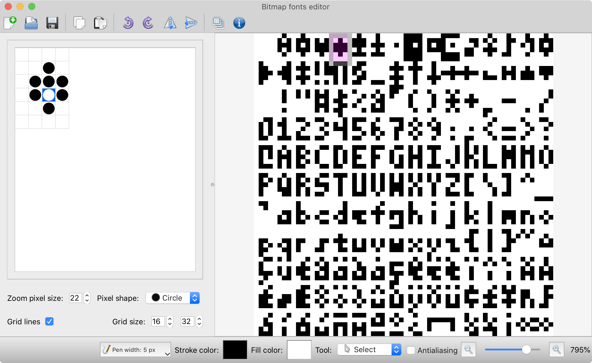

## Simple paint/bitmap fonts editor

Adhoc solution for quick fixing several bitmap fonts I use in my [Godot's](https://github.com/ppiecuch/godot) console.

Might be *usefull* if you looking for a simple and extensible source code that you can use for building paint tools.
